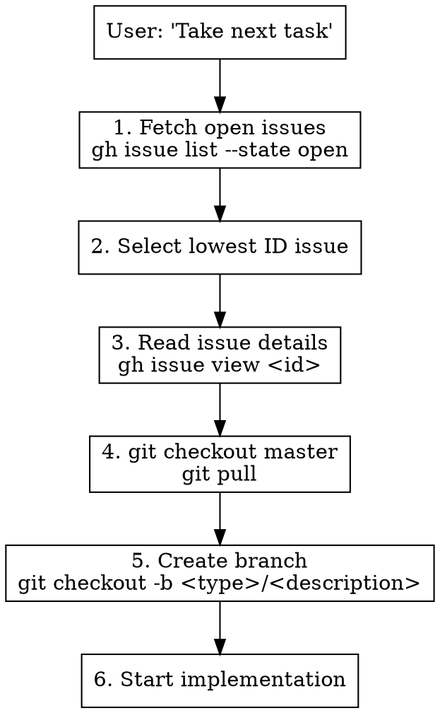

# Taking Next Task

## Overview

Streamlined workflow for picking up the next GitHub issue. Automatically selects the lowest-numbered open issue, ensures clean git state, creates a feature branch, and starts implementation.

## When to Use

- User says "take the next task" or "start the next issue"
- Beginning a new development session
- Finished one issue and ready for the next

## Workflow



## Steps

### 1. Find Next Issue
```bash
gh issue list --state open --json number,title --limit 50
```
Select the issue with the **lowest ID number**.

### 2. Read Issue Details
```bash
gh issue view <issue-number>
```
Understand the full requirements before starting.

### 3. Sync with Master
```bash
git checkout master
git pull origin master
```

### 4. Create Feature Branch
Branch naming convention based on issue type:
- `feat/<short-description>` - New features
- `fix/<short-description>` - Bug fixes
- `chore/<short-description>` - Maintenance tasks

Example: Issue #12 "Add Swedish language support" → `feat/swedish-language-support`

### 5. Start Work
- Use EnterPlanMode for non-trivial tasks
- Follow TDD for implementation
- Reference the issue number in commits

## Quick Reference

| Step | Command |
|------|---------|
| List open issues | `gh issue list --state open` |
| View issue | `gh issue view <id>` |
| Sync master | `git checkout master && git pull` |
| Create branch | `git checkout -b feat/<name>` |

## Branch Naming

| Issue Type | Branch Prefix | Example |
|------------|---------------|---------|
| Feature | `feat/` | `feat/swedish-language` |
| Bug fix | `fix/` | `fix/dashboard-stats` |
| Chore | `chore/` | `chore/update-deps` |
| Docs | `docs/` | `docs/api-reference` |